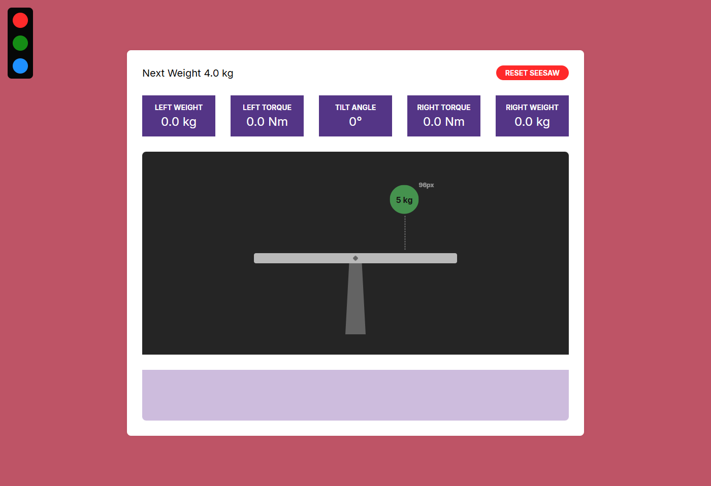
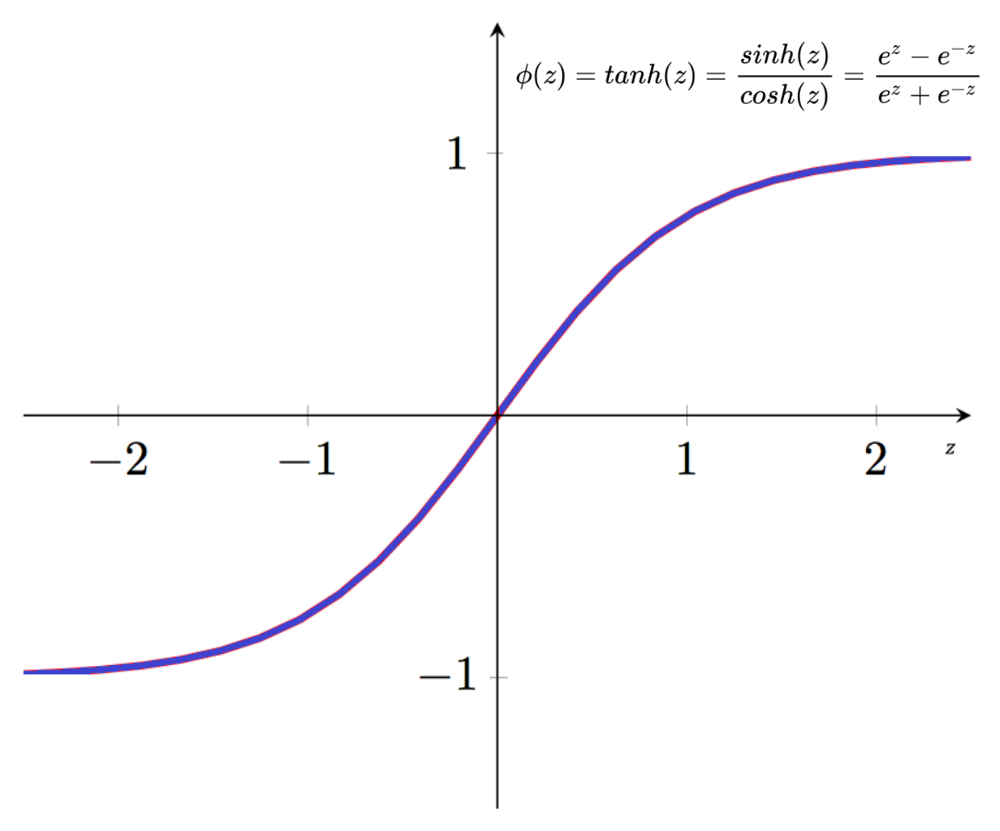

# Seesaw Simulation



Introduction Video: [ekin.codes/seesaw-video.mp4](https://ekin.codes/seesaw-video.mp4)

## About

Interactive seesaw simulation demonstrating balance, torque, and weight distribution. Written with HTML5, CSS and JavaScript.

## Features

- Seasaw Physics
- Weight, Torque, and Tilt Angle Metrics
- Interactive Object Placement
- State Persistence with Local Storage
- Dynamic UI & Smooth Animations

## Getting Started

View the live demo: [Seesaw Simulation Web Page](https://xaszanyn.github.io/Ekin-Aslan-Seesaw-Simulation/)

To run the project locally, clone the repository and open with Live Server:<br />
`git clone https://github.com/username/repo.git`

## Design Approach

The main goals of the project are to provide realistic behavior in the simulation, easy user interaction, and a simple, non-DRY codebase that allows for further development and scalability. The design and development process of the project is divided into three phases, core structure development, modular refactoring & optimization, and implementation of additional features.

### Project Structure

```text
Seesaw-Simulation/
┣━━ index.html
┣━┳ css/
┃ ┗━━ style.css
┣━┳ img/
┃ ┣━━ cover.png
┃ ┗━━ hyperbolic-tangent.png
┣━┳ js/
┃ ┣━━ script.js
┃ ┣━━ elements.js
┃ ┣━━ ui.js
┃ ┣━━ storage.js
┃ ┗━━ sound.js
┣━┳ sounds/
┃ ┣━━ key-press.mp3
┃ ┣━━ pop.mp3
┃ ┗━━ whoosh.mp3
┣━━ favicon.ico
┗━━ README.md
```

### Limitations

One of the most important design decisions was how to calculate the tilt angle. Simply using the ratio of torques did not produce a proper tilt angle. Applying the sigmoid hyperbolic tangent function resulted in a more realistic distribution of balance across the seesaw. In a fully realistic simulation, the seesaw would always increase its angle in the direction of the torque difference until reaching a maximum cap. However, in this project, the primary goal is to indicate the balance based on the relationship between the torques rather than perfectly simulating full physical behavior.

```javascript
state.tiltAngle = Math.round(Math.tanh(Math.log(rightTorque / leftTorque)) * 30 * 100) / 100;
```



### AI Assistance

Although AI was not involved in the core logic or structure of the project, it was used during the development process for tasks such as debugging, especially in trigonometric formulas, organizing and refactoring the modular structure, improving naming conventions, documentation, and implementing audio pitch shifting.

## Contact

Ekin Aslan

Email: [ekinaslan.js@gmail.com](mailto:ekinaslan.js@gmail.com)<br />
LinkedIn: [linkedin.com/in/ekin-aslan-js/](https://www.linkedin.com/in/ekin-aslan-js/)<br />
GitHub: [github.com/Xaszanyn](https://github.com/Xaszanyn)<br />
Website: [ekin.codes](https://ekin.codes)
